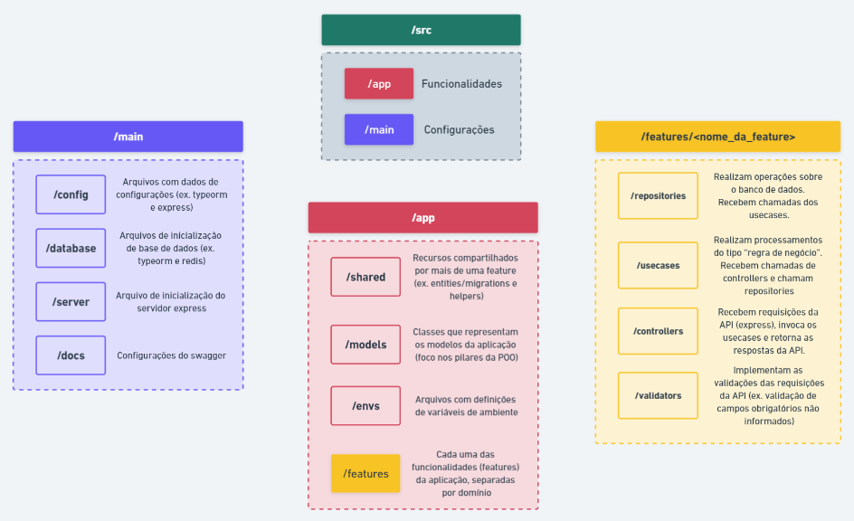

# ARQUITETURA DE SOFTWARE

Para a sequência do módulo, vamos explorar uma arquitetura que é organizada por features.
Arquitetura em camadas.



## Explicação sobre os módulos

### Main

* ```config/server```: configuração do express
* ```config/database```: configuração do typeorm
* ```config/routes```: definição base das rotas
  * As rotas de cada feature ficam na pasta da feature
* ```database```: instanciação do datasouce (typeorm)
* ```server```: instanciação do app e listen do server
  * Apontar o início do app para este arquivo no package.json

### App

* ```shared```: pasta com funcionalidades compartilhadas por mais de uma feature. Entities e migrations do typeorm ficam aqui. HttpHelper e demais utils também.
* ```models```: modelagem de classes (foco em POO e seus pilares)
* ```envs```: divisão das variáveis de ambiente em um arquivo separado por “objetivo”
  * Importante para não precisar importar o dotenv/config em todos os arquivos
* ```features/<nome_da_feature>```: pasta para cada feature da aplicação

### Feature

* ```controllers```: recebe uma requisição express, chama o usecase e retorna sucesso/falha baseado no retorno do usecase.
* ```usecases```: recebe um chamado do controller e realiza um tipo de regra de negócio para processar a requisição. Deve receber um DTO específico e retornar outro. Pode chamar outros usecases ou repositories.
* ```repositories```: realizam operações sobre o banco de dados. Devem receber um model como parâmetro e devolver uma instância de um model quando há retorno com dados. Trabalha com adaptação de-para com modelo <-> entity.
* ```validators```: implementam validações dos campos das requisições da API, devem ser usados como middlewares.
